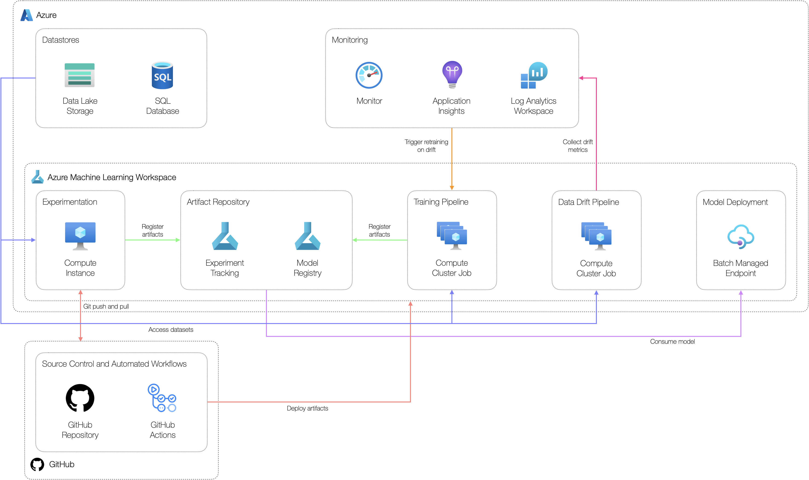

# Managed Batch Endpoint Example Scenario

## Solution Overview

### Potential use cases

This approach is best suited for:

- High throughput scenarios
- Enriching data residing in a data lake at a pre-defined frequency

### Solution Design

The below diagram shows a high-level design for implementing batch scoring workloads suitable for classical machine learning scenarios using Azure Machine Learning.



The solution consists of:

- **Datastores:** production-grade data used to develop models.
- **Experimentation workstation:** workstation where data scientists can access data, explore data and develop machine learning models.
- **Artefact repository:** place to store machine learning models and experiment metrics.
- **Training pipeline:** machine learning pipeline job used to build a model artifact for deployment.
- **Model deployment:** managed batch endpoint used to host the model artifact for batch inferencing.
- **Monitoring:** central monitoring solution for application and model logs and metrics. Inference data and data drift metrics are stored here.
- **Data drift pipeline:** pipeline job to calculate data drift metrics based on inference data and model training data.
- **Source control:** solution to track code.
- **Automated workflows:** workflows to automate the build and deployment of different components used in the solution.

The end-to-end workflow operation consists of:

1. Creating a machine learning model as an output from a pipeline job designed to develop a model artifact for the relevant use case.
2. The model artifact is registered in the model registry and consumed by the batch managed endpoint.
3. When triggered, the batch managed endpoint will consume a data set as an input and produce a data set as an output.
4. Data drift metrics will be calculated via a pipeline job and sent to Azure Monitor via Application Insights as custom metrics.
5. Alerts can be triggered in Azure Monitor to retain and re-deploy models via triggering a pipeline job designed to develop a model artifact.

### Continuous Integration and Continuous Delivery Workflow

The below diagram shows the overall CI/CD process as built with GitHub Actions. This approach consists of three environments consisting of an identical set of resources.


The environments include:

- **Development:** used by developers to build and test their solutions.
- **Staging:** used to test deployments before going to production in a production-like environment. Any integration tests are run in this environment.
- **Production:** used for the final production environment.

## Implementation Process

> **Note:** As with all Azure Deployments, this will incur associated costs. Remember to teardown all related resources after use to avoid unnecessary costs.

### Prerequisites

Before implementing this example scenario the following are needed:

- Azure subscription (contributor or owner)
- GitHub account
- Azure Machine Learning workspace

### Initial Setup

Ensure an Azure Machine Learning workspace with associated resources is created, forked this repository into a new Github repository, set the following required environment variables, and configure the Azure CLI defaults. To configure the Azure CLI defaults execute:

```bash
GROUP=<resource-group>
WORKSPACE=<aml-workspace>
LOCATION=<aml-workspace-location>

az configure --defaults group=$GROUP workspace=$WORKSPACE location=$LOCATION
```

Upload the `core/data/raw/data.csv` and `core/data/inference/data.csv` data sets to the default blob datastore `workspaceblobstore` used by Azure Machine Learning. Ensure these files are uploaded to `data/employee-attrition/raw` and `data/employee-attrition/inference` directories respectively.

### Model Training Pipeline

Create an Azure Machine Learning environment called `employee-attrition-train` for the model training pipeline. An Azure Machine Learning environment specifies the runtime, Python packages, environment variables, and software settings.

To register the environment for the model training pipeline in the Azure Machine Learning workspace execute:

```bash
az ml environment create -f core/environments/train.yml
```

The model training pipeline is defined in `core/pipelines/model_development.yml`. It orchestrates the model development process by executing data preprocessing, model training with hyperparameter tuning, and model registration logic encapsulated in different scripts. These are found in the `core/src` directory. This pipeline can be used to train an initial model and subsequent model version (i.e. retraining).

To create the machine learning model artifact a pipeline job must be triggered by executing:

```bash
az ml job create -f core/pipelines/model_development.yml
```

A byproduct of executing the model training pipeline is the preprocessed dataset that will be written to the default blob datastore `workspaceblobstore`. This can be used as an input to the data drift pipeline.

### Managed Batch Endpoint Deployment

Once the model has been developed and the model artifact has been registered in the Azure Machine Learning workspace a managed batch endpoint can be created. Managed batch endpoints simplify the process of hosting machine learning models by exposing an HTTPS endpoint that clients can call to trigger a batch scoring job. When deploying MLflow model scoring code and an execution environment is auto-generated. This approach is adopted in this example scenario.

To deploy the managed batch endpoint an endpoint must first be created. An endpoint defines the HTTPS endpoint that clients can call. An endpoint can be created by executing:

```bash
az ml online-endpoint create -f core/deploy/batch/endpoint.yml
```

Next, a deployment must be created for the endpoint. A deployment is a set of computing resources hosting the model that does the actual scoring. A deployment can be created by executing:

```bash
az ml online-deployment create -f core/deploy/online/deployment.yml
```

To evoke the batch endpoint several options exist including CLI, REST, or manually via the workspace UI.

```bash
ENDPOINT_NAME=employee-attrition-be
DATA_SET_LOCAL_PATH=data/employee-attrition/inference/data.csv

az ml batch-endpoint invoke --name $ENDPOINT_NAME --input $DATA_SET_LOCAL_PATH
```

The following resource available [here](https://docs.microsoft.com/en-us/azure/machine-learning/how-to-use-batch-endpoint) provides more information about managed batch endpoints.

### Data Drift Pipeline

Data drift is one of the top reasons model accuracy degrades over time. For machine learning models, data drift is the change in model input data that leads to model performance degradation. Monitoring data drift helps detect these model performance issues.

Causes of data drift include:

- Upstream process changes, such as a sensor being replaced that changes the units of measurement from inches to centimetres.
- Data quality issues, such as a broken sensor always reading 0.
- Natural drift in the data, such as mean temperature changing with the seasons.
- Change in the relation between features, or covariate shift.

To calculate data drift Evidently AI, an open-source framework to evaluate, test, and monitor ML models, is used.

In this example scenario, a data drift pipeline job will be triggered and metrics will be calculated and sent to Azure Monitor via Application Insights as custom metrics. The model data drift pipeline is defined in `core/pipelines/data_drift.yml`. This pipeline can be triggered on a re-occurring schedule whenever data drift metrics need to be calculated.

First, an environment called `employee-attrition-drift` for the data drift pipeline must be created by executing:

```bash
az ml environment create -f core/environments/drift.yml
```

Next, the data drift pipeline job can be triggered by executing:

```bash
az ml job create -f core/pipelines/data_drift.yml
```

### Model Monitoring

Azure Monitor is used as the central solution for collecting, analysing, and acting on telemetry within this example scenario. With Azure Monitor, logs can be analysed via Log Analytics, visualisations can be created from metrics, and alerts can be configured.

The data drift pipeline generates logs for the overall level of data drift and the level of data drift for each feature between the baseline and target data sets. The baseline data set can be thought of the data set used to develop the machine learning model and the inference data set can be thought of the data set which has been consumed by the model to make predictions over a given time period.

Using the Log Analytics workspace logs collected from the data drift pipeline through Azure Application Insights can be analysed to monitor data drift to ensure models are performing well.

To view overall data drift metrics the following query can be executed in Log Analytics:

```kql
traces
| where message has 'employee-attrition' and message has 'OverallDriftMetrics'
| project timestamp, data=parse_json(tostring(message)).data
| evaluate bag_unpack(data)
```

To view feature level data drift metrics the following query can be executed in Log Analytics:

```kql
traces
| where message has 'employee-attrition' and message has 'FeatureDriftMetrics'
| project timestamp, data=parse_json(tostring(message)).data
| mv-expand data
| evaluate bag_unpack(data)
```

## Related resources

The following references might be useful:

- [Use batch endpoints for batch scoring](https://docs.microsoft.com/en-us/azure/machine-learning/how-to-use-batch-endpoint)
