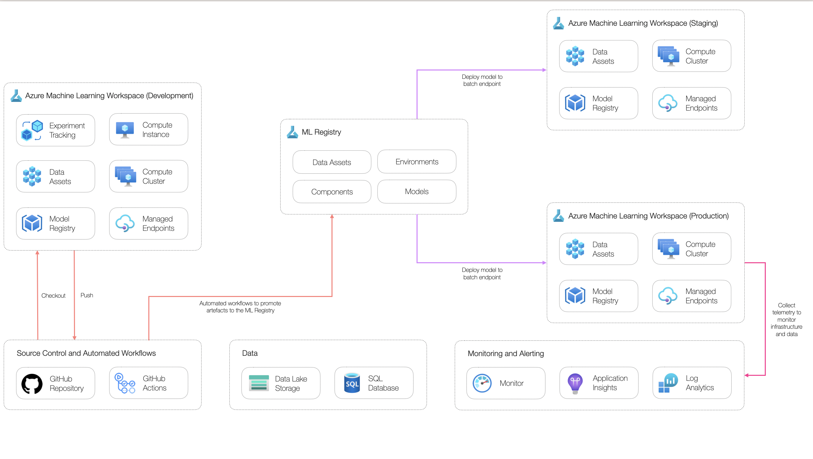

# Managed Batch Endpoint Example Scenario

## Solution Overview

### Potential Use Cases

This approach is best suited for:

- High throughput scenarios
- Enriching data residing in a data lake at a pre-defined frequency

### Solution Design

The below diagram shows a high-level design for implementing batch scoring workloads suitable for classical machine learning scenarios using Azure Machine Learning.



The solution consists of:

- **Datastores:** production-grade data used to develop models.
- **Experimentation workstation:** workstation where data scientists can access data, explore data and develop machine learning models.
- **Training pipeline:** machine learning pipeline job used to build a model artifact for deployment.
- **Model deployment:** managed batch endpoint used to host the model artifact for batch inferencing.
- **Monitoring:** central monitoring solution for application and model logs and metrics. Inference data and data drift metrics are stored here.
- **Data drift pipeline:** pipeline job to calculate data drift metrics based on inference data and model training data.
- **Source control:** solution to track code.
- **Automated workflows:** workflows to automate the build and deployment of different components used in the solution.
- **Machine Learning Registry:** central registry for storing and sharing artifacts (model, environments and components) between workspaces in staging and production from a single location.

1. Creating a machine learning model as an output from a pipeline job designed to develop a model artifact for the relevant use case.
2. The model artifact is registered in the Machine Learning Registry and consumed by the batch managed endpoint.
3. When triggered, the batch managed endpoint will consume a data set as an input and produce a data set as an output.
4. Data drift metrics will be calculated via a pipeline job and sent to Azure Monitor via Application Insights as custom metrics.
5. Alerts can be triggered in Azure Monitor to retain and re-deploy models via triggering a pipeline job designed to develop a model artifact.

### Continuous Integration and Continuous Delivery Workflow

The below diagram shows the overall CI/CD process as built with GitHub Actions. This approach consists of three environments consisting of an identical set of resources.


The environments include:

- **Development:** used by developers to build and test their solutions.
- **Staging:** used to test deployments before going to production in a production-like environment. Any integration tests are run in this environment.
- **Production:** used for the final production environment.

## Scenario Walkthrough

This section describes the main components of the example scenario that relate to implementing a batch scoring scenario with Azure Machine Learning managed batch endpoints. Each section will describe the key files and the role they play in the context of the overall solution.

> **Note:**
> For detailed instructions to deploy this example scenario to a personal Azure environment see the [Step-by-Step Setup](./step-by-step.md) section of this repository. This will result in a machine learning model being trained, registered in both environments, deployed as both a managed batch endpoint and a managed online endpoint, and scheduled execution of the `Data Export` and `Data Drift` pipelines periodically.

### Data Assets

A reference to data assets stored within a datastore needs to be created. Two data assets will be created in this example scenario - one for training a model referencing `core/data/credit-card-default/curated/01.csv` and another for model inference referencing `core/data/credit-card-default/inference/batch/01.csv`. Azure Machine Learning datasets enable:

- Keep a single copy of data in storage referenced by datasets.
- Seamlessly access data during model training without worrying about connection strings or data paths.
- Share data and collaborate with other users.
- Create different versions of datasets.

### Model Training Pipeline

An Azure Machine Learning environment called `credit-card-default-train` for the model training pipeline will need to be created. An Azure Machine Learning environment specifies the runtime, Python packages, environment variables, and software settings.

To register the environment for the model training pipeline in the Azure Machine Learning workspace execute:

```bash
az ml environment create -f core/environments/train.yml
```

To register the curated data for the model training pipeline in the Azure Machine Learning workspace execute:

```bash
az ml data create -f core/data/credit-card-default/curated.yml
```

The model training pipeline is defined in `core/pipelines/train_model.yml`. It orchestrates the model development process by executing data preprocessing, data quality reporting, model training with hyperparameter tuning, and model registration logic encapsulated in different scripts. These are found in the `core/src` directory. This pipeline can be used to train an initial model and subsequent model version (i.e. retraining).

To create the machine learning model artifact a pipeline job must be triggered by executing:

```bash
az ml job create -f core/pipelines/train_model.yml
```

A byproduct of executing the model training pipeline is a prepared dataset that will be written to the default blob datastore `workspaceblobstore`.

### Managed Batch Endpoint Deployment

Once the model has been developed and the model artifact has been registered in the Azure Machine Learning workspace a managed batch endpoint can be created. Managed batch endpoints simplify the process of hosting machine learning models by exposing an HTTPS endpoint that clients can call to trigger a batch scoring job. When deploying MLflow model, scoring code and an execution environment is automatically generated. This approach is adopted in this example scenario.

To deploy the managed batch endpoint an endpoint must first be created. An endpoint defines the HTTPS endpoint that clients can call. An endpoint can be created by executing:

```bash
az ml batch-endpoint create -f core/deploy/batch/endpoint.yml
```

Next, a deployment must be created for the endpoint. A deployment is a set of computing resources hosting the model that does the actual scoring. A deployment can be created by executing:

```bash
az ml batch-deployment create -f core/deploy/batch/deployment.yml
```

To register the inference data for batch inference in the Azure Machine Learning workspace execute:

```bash
az ml data create -f core/data/credit-card-default/inference-batch.yml
```

To evoke the batch endpoint several options exist including CLI, REST, or manually via the workspace UI.

```bash
ENDPOINT_NAME=credit-card-default-be
DATA_SET_LOCAL_PATH=core/data/credit-card-default/inference/data.csv

az ml batch-endpoint invoke --name $ENDPOINT_NAME --input $DATA_SET_LOCAL_PATH
```

The following resource available [here](https://docs.microsoft.com/azure/machine-learning/how-to-use-batch-endpoint) provides more information about managed batch endpoints.

### Data Drift Pipeline

Data drift is one of the top reasons model accuracy degrades over time. For machine learning models, data drift is the change in model input data that leads to model performance degradation. Monitoring data drift helps detect these model performance issues.

Causes of data drift include:

- Upstream process changes, such as a sensor being replaced that changes the units of measurement from inches to centimetres.
- Data quality issues, such as a broken sensor always reading 0.
- Natural drift in the data, such as mean temperature changing with the seasons.
- Change in the relation between features, or covariate shift.

To calculate data drift Evidently AI, an open-source framework to evaluate, test, and monitor ML models, is used.

In this example scenario, a data drift pipeline job will be triggered and metrics will be calculated and sent to Azure Monitor via Application Insights as custom metrics. The model data drift pipeline is defined in `core/pipelines/data_drift.yml`. This pipeline can be triggered on a re-occurring schedule whenever data drift metrics need to be calculated.

First, an environment called `credit-card-default-drift` for the data drift pipeline must be created by executing:

```bash
az ml environment create -f core/environments/drift.yml
```

Next, the data drift pipeline job can be triggered by executing:

```bash
az ml job create -f core/pipelines/data_drift.yml
```

This pipeline will be triggered as part of an Azure Machine Learning pipeline schedule.

### Model Monitoring

Azure Monitor is used as the central solution for collecting, analysing, and acting on telemetry within this example scenario. With Azure Monitor, logs can be analysed via Log Analytics, visualisations can be created from metrics, and alerts can be configured.

The data drift pipeline generates logs for the overall level of data drift and the level of data drift for each feature between the baseline and target data sets. The baseline data set can be thought of the data set used to develop the machine learning model and the inference data set can be thought of the data set which has been consumed by the model to make predictions over a given time period.

Using the Log Analytics workspace logs collected from the data drift pipeline through Azure Application Insights can be analysed to monitor data drift to ensure models are performing well.

To view overall data drift metrics the following query can be executed in Log Analytics:

```kql
traces
| where message has 'credit-card-default' and message has 'OverallDriftMetrics'
| project timestamp, data=parse_json(tostring(message)).data
| evaluate bag_unpack(data)
```

To view feature level data drift metrics the following query can be executed in Log Analytics:

```kql
traces
| where message has 'credit-card-default' and message has 'FeatureDriftMetrics'
| project timestamp, data=parse_json(tostring(message)).data
| mv-expand data
| evaluate bag_unpack(data)
```

### Automated Model Training, Deployment, and Monitoring

To automatically build all assets and deploy them to staging and production environments GitHub Actions is used. GitHub Actions is a continuous integration and continuous delivery (CI/CD) platform that allows for the creation of automated build, test, and deployment pipelines. Workflows can be created that build and test every pull recommendation to a repository or deploy merged pull requests to production.

With GitHub Actions and establishing similar workflows, machine learning teams can build their levels of maturity operationalising machine learning models (MLOps). Some goals of implementing MLOps for machine learning projects include:

- Automated deployment of machine learning models to production.
- Creating secured, reproducible and scalable machine learning workflows.
- Manage models and capture data lineage.
- Enable continuous delivery with IaC and CI/CD pipelines.
- Monitor performance and feedback information from models.
- Providing compliance, security, and cost tools for machine learning development.
- Increasing collaboration and experimentation.

In this example scenario, four workflows have been developed in the `.github/workflows` directory. Reusable sub workflows are in the `.github/templates` directory and are used more than once across one or more workflows. The main workflows in this example scenario are:

- **Code Quality:** implementing regular code scanning on select branches when code is pushed and on a schedule.
- **Create Data Assets:** workflow intended to deploy new data assets to staging and production environments as they are created. Data assets are defined in specification files which trigger the workflow as changes are committed.
- **Create Environments:** workflow intended to deploy new Azure Machine Learning environments to staging and production environments as they are created. Azure Machine Learning environments are defined in specification files which trigger the workflow as changes are committed.
- **Build Model:** a workflow that trains a model in a staging environment and registers a model artifact to the workflow. This workflow will automatically trigger the `Deploy Model for Batch Inference` workflow upon completion. Triggering this workflow on a schedule can be used to implement a model retraining process.
- **Deploy Model for Batch Inference:** a workflow that creates endpoints and deployments referencing the model in the staging environment, copies model assets to the production environment, and recreates endpoints and deployments in the production environment.

## Related Resources

The following references might be useful:

- [Use batch endpoints for batch scoring](https://docs.microsoft.com/azure/machine-learning/how-to-use-batch-endpoint)
- [Azure Machine Learning registry](https://learn.microsoft.com/azure/machine-learning/how-to-share-models-pipelines-across-workspaces-with-registries?tabs=cli)
