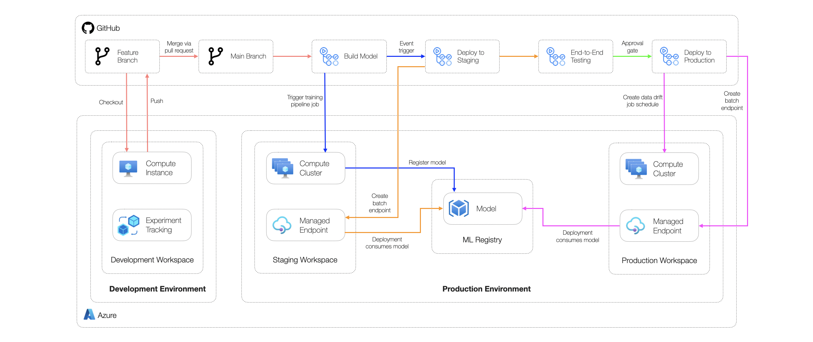
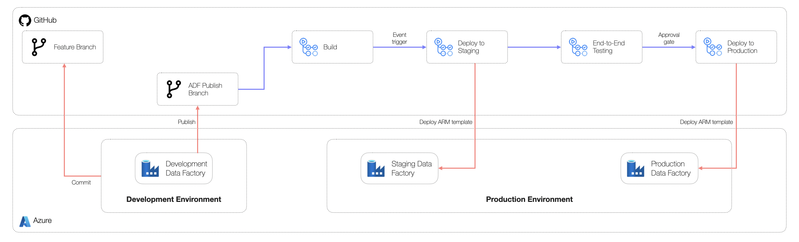

# Azure Data Factory / Azure Synapse Pipeline Example Scenario

## Solution Overview

### Potential use cases

This approach is best suited for:

- High throughput scenarios
- Enriching data residing in a data lake at a pre-defined frequency as part of a batch scoring scenario
- Integrate Azure Machine Learning batch managed endpoints with a broader set of data stores

### Solution Design

The below diagram shows a high-level design for implementing batch scoring workloads suitable for classical machine learning scenarios using Azure Machine Learning which are orchestrated via Azure Data Factory.

The solution consists of the following components:

- **Datastores:** production-grade data used to develop models.
- **Experimentation workstation:** workstation where data scientists can access data, explore data and develop machine learning models.
- **Orchestration:** central solution responsible for triggering pipelines and orchestrating data movement.
- **Training pipeline:** machine learning pipeline job used to build a model artifact for deployment.
- **Model deployment:** managed batch endpoint used to host the model artifact for batch inferencing.
- **Monitoring:** central monitoring solution for application and model logs and metrics. Inference data and data drift metrics are stored here.
- **Data drift pipeline:** pipeline job to calculate data drift metrics based on inference data and model training data.
- **Source control:** solution to track code.
- **Automated workflows:** workflows to automate the build and deployment of different components used in the solution.
- **Machine Learning Registry:** central registry for storing and sharing artifacts (model, environments and components) between workspaces in staging and production from a single location.

> **Note:**
>
> The same Azure Data Factory instance can be shared across many use-cases.

The end-to-end workflow operation consists of:

1. Creating a machine learning model as an output from a pipeline job designed to develop a model artifact for the relevant use case.
2. The model artifact is registered in the Machine Learning Registry and consumed by the batch managed endpoint.
3. When triggered, the batch managed endpoint will consume a data set as an input and produce a data set as an output.
4. An Azure Data Factory pipeline will be used to orchestrate all batch inferencing and data movement. This pipeline will call the batch managed endpoint in Azure Machine Learning and copy the output data set to another destination (e.g. Azure SQL DB or another Azure Data Factory sink).
5. Data drift metrics will be calculated via a pipeline job and sent to Azure Monitor via Application Insights as custom metrics.
6. Alerts can be triggered in Azure Monitor to retain and re-deploy models via triggering a pipeline job designed to develop a model artifact.

> **Note:**
>
> A metadata-driven approach should be adopted for scaling pipelines used for orchestration.
> In this approach Azure Data Factory pipelines will capture logic for generic workflows (e.g. calling a managed batch endpoint and writing data to Azure SQL DB).
>
> When executing each pipeline, metadata will be extracted from a database which will govern the exact managed batch endpoint and sink which will be used by the pipeline.
> These will be passed to the pipeline as parameters.

### Continuous Integration and Continuous Delivery Workflow

The below diagram shows the overall CI/CD process as built with GitHub Actions. This approach consists of three environments consisting of an identical set of resources.

Azure Machine Learning artifacts will follow the build and release process shown in the below diagram.

Azure Data Factory pipelines will follow the build and release process shown in the below diagram. It's important that the associated Azure Machine Learning artifacts have to be created first in each environment.

The environments include:

- **Development:** used by developers to build and test their solutions.
- **Staging:** used to test deployments before going to production in a production-like environment. Any integration tests are run in this environment.
- **Production:** used for the final production environment.

> **Note:**
> In a metadata-driven approach re-deploying the Azure Data Factory pipelines is not necessary if a separate use-case adopts logic captured in an existing Azure Data Factory pipeline.
> In this approach a new record can be added to the control table in the database which stores metadata for the pipeline.
> For this an updated DACPAC or run scripts using SQLCMD can be used within the CI/CD pipeline.

## Scenario Walkthrough

This section describes the main components of the example scenario that relate to implementing a batch scoring scenario with an Azure Machine Learning managed batch endpoints and Azure Data Factory. Each section will describe the key files and the role they play in the context of the overall solution.

> **Note:**
> For detailed instructions to deploy this example scenario to a personal Azure environment see the [Step-by-Step Setup](./step-by-step-adf.md) section of this repository.

### Azure Data Factory Pipeline

Azure Data Factory is the primary service within Azure for orchestrating data movement. These workflows are defined in pipelines consisting of various interlinked activities. Scalable Azure Data Factory pipelines are parameterized and driven by metadata defined in a control table. The pipeline defines the general logic of the workflow while the metadata defines the exact configuration.

A common pattern for implementing batch inference scenarios within the Azure ecosystem consists of using Azure Machine Learning and Azure Data Factory. This pattern is characterized by loading data from one or more systems into an Azure Machine Learning datastore, performing inference using a managed batch endpoint, then writing the output to a different target that is not natively supported by Azure Machine Learning.

The `Machine Learning Execute Pipeline` activity provides native integration between Azure Machine Learning and Azure Data Factory. This activity lets you call a pre-defined Azure Machine Learning endpoint as part of your Azure Data Factory pipeline. This component is useful for many use cases but in some circumstances it can create limitations.

This example scenario will outline a custom approach to developing an Azure Data Factory which integrates with a managed batch endpoint within Azure Machine Learning. The aims of this approach are:

1. Greater decoupling between the Azure Data Factory pipeline and the Azure Machine Learning managed batch endpoint by removing the requirement to hard-code the Azure Machine Learning Pipeline ID. This will simplify deployment workflows and enable greater agility.
2. Greater control over data movement by allowing input and output datastore URIs to be defined. This will enable specific files within an Azure Machine Learning datastore (e.g. a Storage account) to be referenced as either inputs or outputs to the managed batch endpoint.
3. Greater flexibility to customize the pipeline by manually calling Azure Machine Learning's REST APIs. This will enable more granular customization and debugging capabilities in the pipeline.

The template for a parameterized Azure Data Factory pipeline implementing the custom approach outlined above is defined in the `adf` directory.

### Automated Deployments

In Azure Data Factory, continuous integration and continuous delivery (CI/CD) is characterized by moving Azure Data Factory pipelines from one environment (development, staging, production, etc.) to another. Azure Data Factory utilizes Azure Resource Manager templates to store the configuration of your various ADF entities (pipelines, datasets, data flows, etc.).

Best practice dictates using a CI/CD platform such as GitHub actions (as used in this example scenario) or Azure DevOps to orchestrate the build and movement of artifacts. GitHub Actions allows for the creation of automated build, test, and deployment pipelines to facilitate this. Workflows can be created that build and test every pull recommendation to a repository or deploy merged pull requests to production. For more information on the CI/CD lifecycle in Azure Data Factory, see [Continuous integration and delivery in Azure Data Factory](https://docs.microsoft.com/azure/data-factory/continuous-integration-delivery).

Some development teams might require implementing integrated tests before deploying pipelines to production. For this purpose, the PyTest testing framework can be used, see an example at [ADF Integration Tests](https://github.com/Azure-Samples/modern-data-warehouse-dataops/blob/main/single_tech_samples/datafactory/tests/integrationtests/tests/README.md).

## Related Resources

You might also find these references useful:

- [Use batch endpoints for batch scoring](https://docs.microsoft.com/azure/machine-learning/how-to-use-batch-endpoint)
- [Execute Azure Machine Learning pipelines in Azure Data Factory and Synapse Analytics](https://docs.microsoft.com/azure/data-factory/transform-data-machine-learning-service)
- [Azure Data Factory and Azure Synapse Analytics connector overview](https://docs.microsoft.com/azure/data-factory/connector-overview)
- [Build large-scale data copy pipelines with a metadata-driven approach in copy data tool](https://docs.microsoft.com/azure/data-factory/copy-data-tool-metadata-driven)
- [Continuous integration and delivery in Azure Data Factory](https://docs.microsoft.com/azure/data-factory/continuous-integration-delivery)
- [ADF Integration Tests](https://github.com/Azure-Samples/modern-data-warehouse-dataops/blob/main/single_tech_samples/datafactory/tests/integrationtests/tests/README.md)
- [Deploy a Data-tier Application](https://docs.microsoft.com/sql/relational-databases/data-tier-applications/deploy-a-data-tier-application)
- [CI/CD for Azure SQL Database](https://github.com/Azure-Samples/modern-data-warehouse-dataops/tree/main/single_tech_samples/azuresql)
- [Azure Machine Learning registry](https://learn.microsoft.com/azure/machine-learning/how-to-share-models-pipelines-across-workspaces-with-registries?tabs=cli)
