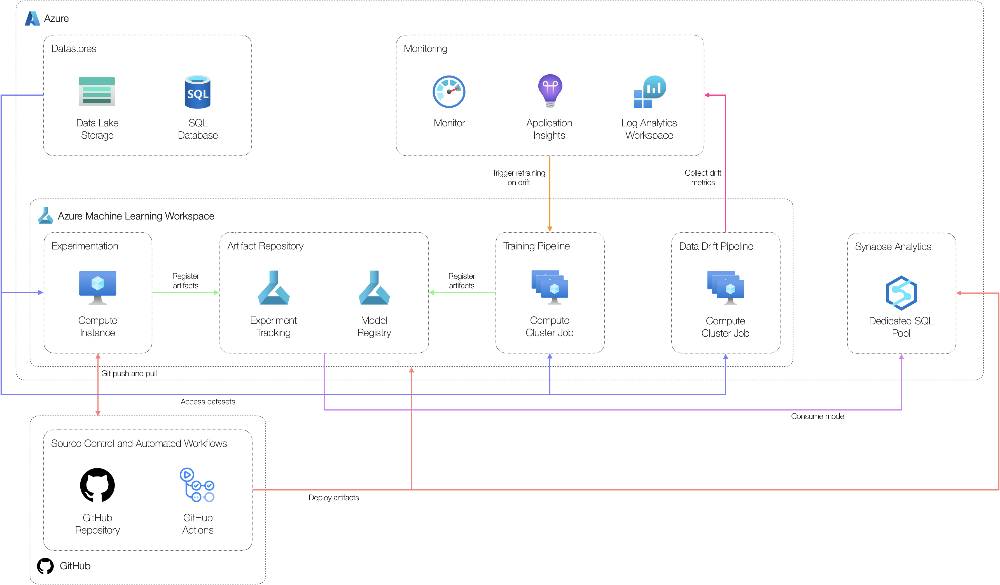

# Azure Synapse Dedicated SQL Pool Example Scenario

## Solution Overview

### Potential use cases

This approach is best suited for:

- High throughput scenarios
- Enriching data residing in a data warehouse at a pre-defined frequency

### Solution Design

The below diagram shows a high-level design for implementing batch scoring workloads suitable for classical machine learning scenarios using Azure Synapse Analytics by consuming machine learning models within a stored procedure.

The solution consists of:

- **Datastores:** production-grade data used to develop models.
- **Experimentation workstation:** workstation where data scientists can access data, explore data and develop machine learning models.
- **Artefact repository:** place to store machine learning models and experiment metrics.
- **Training pipeline:** machine learning pipeline job used to build a model artifact for deployment.
- **Data warehouse:** Azure Synapse Analytics Dedicated SQL Pool used for data warehousing solutions.
- **Monitoring:** central monitoring solution for application and model logs and metrics. Inference data and data drift metrics are stored here.
- **Data drift pipeline:** pipeline job to calculate data drift metrics based on inference data and model training data.
- **Source control:** solution to track code.
- **Automated workflows:** workflows to automate the build and deployment of different components used in the solution.

## Related resources

You might also find these references useful:

- [Tutorial: Machine learning model scoring wizard (preview) for dedicated SQL pools
](https://docs.microsoft.com/en-us/azure/synapse-analytics/machine-learning/tutorial-sql-pool-model-scoring-wizard)
