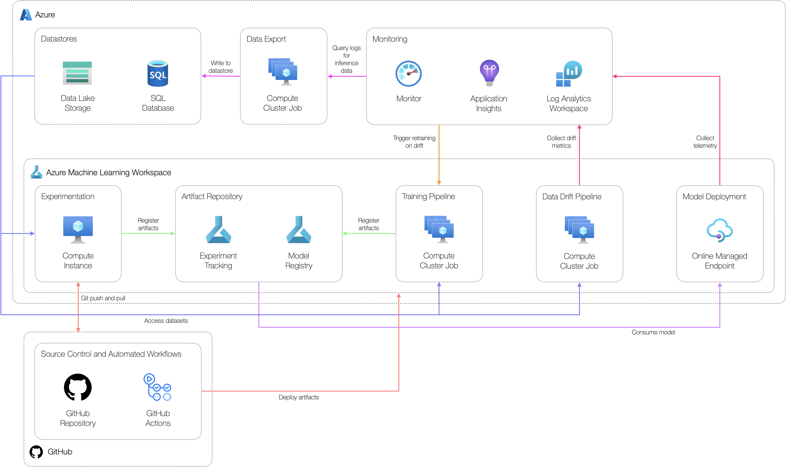
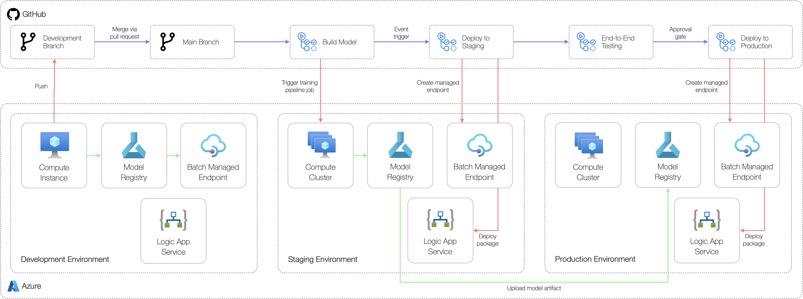

# Managed Online Endpoint Example Scenario

## Solution Overview

### Potential use cases

This approach is best suited for:

- Low-latency and interactive workloads
- Exposing machine learning models as a REST API to integrate with external applications

### Solution Design

The below diagram shows a high-level design for implementing online scoring workloads suitable for classical machine learning scenarios using Azure Machine Learning.

The solution consists of:

- **Datastores:** production-grade data used to develop models.
- **Experimentation workstation:** workstation where data scientists can access data, explore data and develop machine learning models.
- **Artefact repository:** place to store machine learning models and experiment metrics.
- **Training pipeline:** machine learning pipeline job used to build a model artifact for deployment.
- **Model deployment:** managed online endpoint used to host the model artifact for online inferencing.
- **Monitoring:** central monitoring solution for application and model logs and metrics. Inference data and data drift metrics are stored here.
- **Data drift pipeline:** pipeline job to calculate data drift metrics based on inference data and model training data.
- **Data export:** solution to export inference data collected from the managed online endpoint. This can be used to retrain the model or determine data drift.
- **Source control:** solution to track code.
- **Automated workflows:** workflows to automate the build and deployment of different components used in the solution.

The end-to-end workflow operation consists of:

1. Creating a machine learning model as an output from a pipeline job designed to develop a model artifact for the relevant use case.
2. The model artifact is registered in the model registry and consumed by the online managed endpoint.
3. When triggered, the online managed endpoint will consume data within a payload and send a response. This payload will be logged within Azure Monitor.
4. Inference data collected from the request payload can be extracted by an Azure Logic App by querying Azure Monitor and writing the output to blob storage. These can be used as an input to calculating data drift metrics.
5. Data drift metrics will be calculated via a pipeline job and sent to Azure Monitor via Application Insights as custom metrics.
6. Alerts can be triggered in Azure Monitor to retain and re-deploy models via triggering a pipeline job designed to develop a model artifact.

### Continuous Integration and Continuous Delivery Workflow

The below diagram shows the overall CI/CD process as built with GitHub Actions. This approach consists of three environments consisting of an identical set of resources.

The environments include:

- **Development:** used by developers to build and test their solutions.
- **Staging:** used to test deployments before going to production in a production-like environment. Any integration tests are run in this environment.
- **Production:** used for the final production environment.

## Related resources

You might also find these references useful:

- [Deploy and score a machine learning model by using an online endpoint](https://docs.microsoft.com/en-us/azure/machine-learning/how-to-deploy-managed-online-endpoints)
