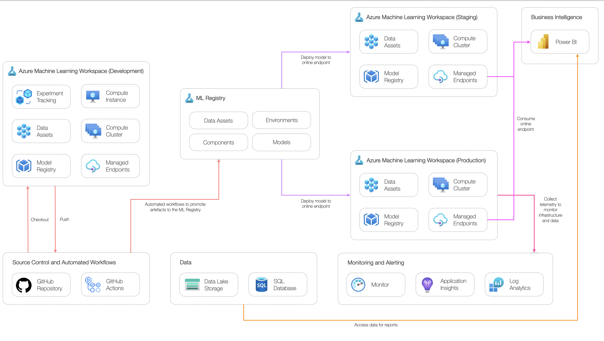

# Power BI Example Scenario

## Solution Overview

### Potential use cases

This approach is best suited for:

- Incorporating machine learning model predictions in Power BI reports.

### Solution Design

The below diagram shows a high-level design for implementing online scoring for reporting scenarios suitable for classical machine learning scenarios using Azure Machine Learning and Power BI.

The solution consists of the following components:

- **Datastores:** production-grade data used to develop models.
- **Experimentation workstation:** workstation where data scientists can access data, explore data and develop machine learning models.
- **Orchestration:** central solution responsible for triggering pipelines and orchestrating data movement.
- **Training pipeline:** machine learning pipeline job used to build a model artifact for deployment.
- **Model deployment:** managed online endpoint used to host the model artifact for online inferencing.
- **Business intelligence platform:** platform to create interactive reports to share insights.
- **Monitoring:** central monitoring solution for application and model logs and metrics. Inference data and data drift metrics are stored here.
- **Data drift pipeline:** pipeline job to calculate data drift metrics based on inference data and model training data.
- **Data export:** solution to export inference data collected from the managed online endpoint. This can be used to retrain the model or determine data drift.
- **Source control:** solution to track code.
- **Automated workflows:** workflows to automate the build and deployment of different components used in the solution.
- **Machine Learning Registry:** central registry for storing and sharing artifacts (model, environments and components) between workspaces in staging and production from a single location.

## Related Resources

You might also find these references useful:

- [Tutorial: Consume Azure Machine Learning models in Power BI](https://docs.microsoft.com/power-bi/connect-data/service-aml-integrate)
- [Azure Machine Learning registry](https://learn.microsoft.com/azure/machine-learning/how-to-share-models-pipelines-across-workspaces-with-registries?tabs=cli)
