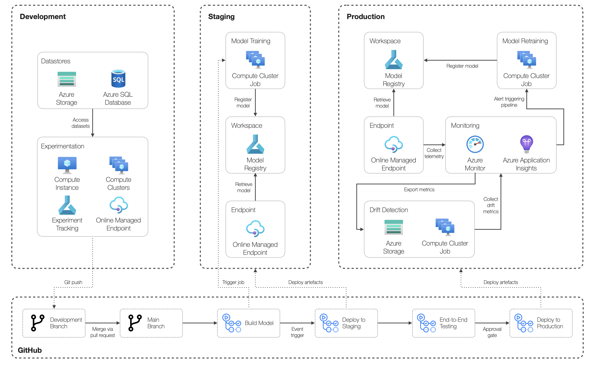

# Real-time Endpoint Example Scenario

## Potential use cases

This approach is best suited for:

- Low-latency and interactive workloads
- Exposing machine learning models as a REST API to integrate with external applications

## Workflow

A high-level workflow for real-time model deployment using Azure Machine Learning Online Endpoints based on MLOps principles and practices is outlined below. This appraoch illistrates each of the main tasks that are executed  in Development, Staging, and Production environments orchastrated via GitHub Actions.



## Implementation walkthrough

### Prerequisites

Before implementing this pattern, you need to:

- Azure subscription (contributor or owner)
- GitHub account
- Azure Machine Learning workspace

### Steps

```bash
az configure --defaults group=$GROUP workspace=$WORKSPACE location=$LOCATION
```

```bash
az ml environment create -f employee-attrition/environments/train.yml
```

```bash
az ml environment create -f employee-attrition/environments/score.yml
```

```bash
az ml job create -f employee-attrition/pipelines/model_development.yml
```

```bash
az ml online-endpoint create -f employee-attrition/deploy/online/endpoint.yml
```

```bash
az ml online-deployment create -f employee-attrition/deploy/online/deployment.yml
```

```kql
AmlOnlineEndpointConsoleLog
| where TimeGenerated > ago (1d)
| where Message has 'online/employee-attrition/1' and Message has 'InputData'
| project TimeGenerated, ResponsePayload=split(Message, '|')
| project TimeGenerated, InputData=parse_json(tostring(ResponsePayload[-1])).data
| project TimeGenerated, InputData=parse_json(tostring(InputData))
| mv-expand InputData
| evaluate bag_unpack(InputData)
```

```kql
traces
| where message has 'employee-attrition' and message has 'OverallDriftMetrics'
| project timestamp, data=parse_json(tostring(message)).data
| evaluate bag_unpack(data)

```

```kql
traces
| where message has 'employee-attrition' and message has 'FeatureDriftMetrics'
| project timestamp, data=parse_json(tostring(message)).data
| mv-expand data
| evaluate bag_unpack(data)
```

## Related resources

You might also find these references useful:

- [Deploy and score a machine learning model by using an online endpoint](https://docs.microsoft.com/en-us/azure/machine-learning/how-to-deploy-managed-online-endpoints)
