# Step-by-Step Setup

> **Note:**
> As with all Azure Deployments, this will incur associated costs. Remember to teardown all related resources after use to avoid unnecessary costs.

## Prerequisites

Before implementing this example scenario the following are needed:

- Azure subscription (contributor or owner)
- GitHub account

## 1. Initial Setup

### 1.1. Deploy Azure Resources

You will need to create a resource group for resources associated with `Staging` and `Production` environments. The same or separate resource groups can be used. Once these have been created a service principal must be created with a `contributor` role assigned to each resource group.

The following command can be used to create this service principal.

```bash

az ad sp create-for-rbac --name <service-principal-name> --role contributor --scopes /subscriptions/<subscription-id>/resourceGroups/<resource-group-name> --sdk-auth
```

The command should output a JSON object similar to this:

```bash
 {
 "clientId": "<GUID>",
 "clientSecret": "<STRING>",
 "subscriptionId": "<GUID>",
 "tenantId": "<GUID>",
 "resourceManagerEndpointUrl": "<URL>"
 (...)
 }
```

Store this JSON object, the `clientId` and `clientSecret` as they will be used in subsequent steps.

> Tip: Use the [Azure Cloud Shell](https://learn.microsoft.com/azure/cloud-shell/overview)

Then an Azure Machine Learning workspace with associated resources for `Staging` and `Production` environments will need to be created. To assist with this an ARM template has been created to automate the deployment of all necessary resources. Use the `Deploy to Azure` button below to automatically deploy these resources. You will need to do this twice to deploy 2 separate instances for `Staging` and `Production` respectively. Note no settings need to be changed except the `Resource Instance` parameter (e.g. `001` and `002` respectively).

In the custom deployment, you will need to add the `clientId` and `clientSecret` for the service principal created earlier. In the `Instance details` section of the custom, deployment add the `clientId` value in the `servicePrincipalClientId` field and the `clientSecret` value in the `servicePrincipalSecret` field.

[](https://portal.azure.com/#create/Microsoft.Template/uri/https%3A%2F%2Fraw.githubusercontent.com%2Fnfmoore%2Fazureml-mlops-example-scenarios%2Fmain%2Finfrastructure%2Fmain.json)

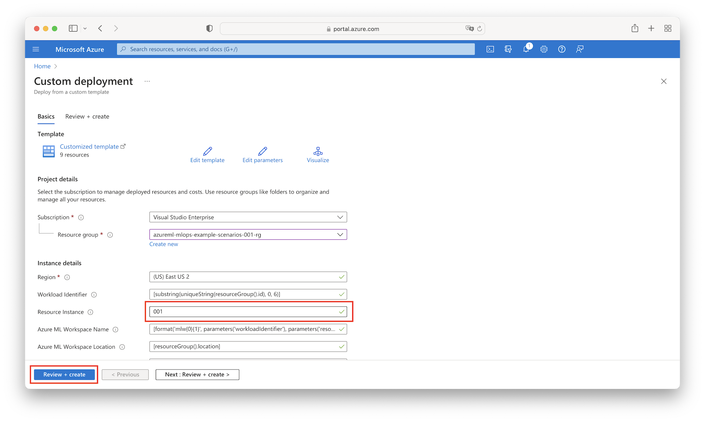

Note that the above deployment will also upload the required data sets and MLTable file specifications found in the `core/data/curated/`, `core/data/inference/batch/`, and `core/data/inference/online/` directories to the default blob datastore `workspaceblobstore`. These will be used as part of this example scenario.

### 1.2. Create GitHub Repository

Log in to your GitHub account and navigate to the [azureml-mlops-example-scenarios](https://github.com/nfmoore/azureml-mlops-example-scenarios) repository and click `use this template` to create a new repository from this template. Rename the template and leave it public. Use [these](https://docs.github.com/en/github/creating-cloning-and-archiving-repositories/creating-a-repository-from-a-template) instructions for more details about creating a repository from a template.

### 1.3. Configure GitHub Actions Environments

GitHub Environments are used to describe the `Staging` and `Production` deployment targets and will be used to configure protection rules and secrets in this example scenario.

To set up these environments, from the GitHub repository you created in `1.1` click the `Settings` tab in the menu bar. On the new page select `Environments` from the sidebar. Click the `New Environment` button and create an environment with the `Name` of `Staging`. Repeat this to create a second environment with the `Name` of `Production`.

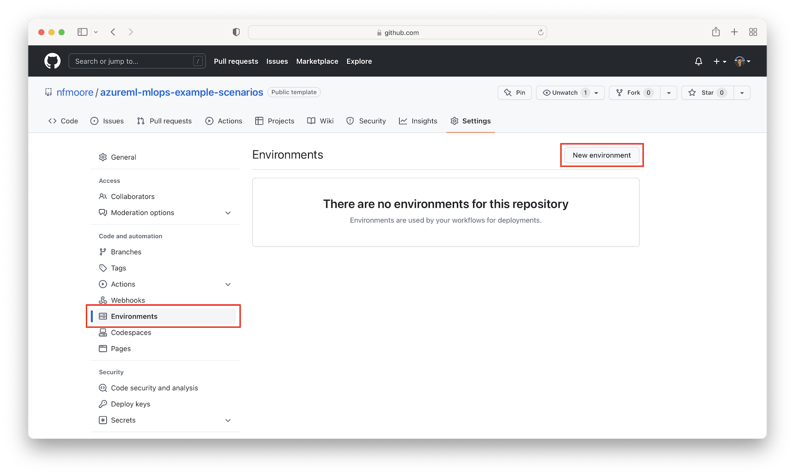

Next, you will configure GitHub Action secrets. These are encrypted environment variables used within GitHub Actions Workflows. Click the `Settings` tab in the menu bar of your GitHub repository and on the new page then select `Secrets` from the sidebar. Click the `New Repository Secret` button to create a new secret and then the `Add Secret` button to create the secret.

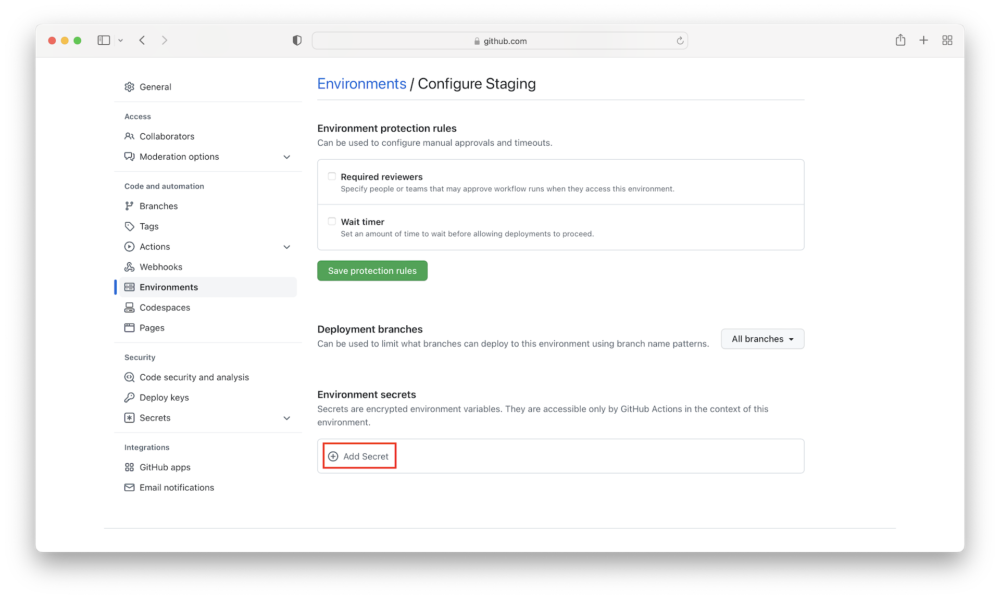

You need to create the following secrets in each environment:

| Secret name | How to find secret value |
|:------------|:-------------------------|
| AZURE_CREDENTIALS | A JSON object with details of your Azure Service Principal. [This](https://github.com/marketplace/actions/azure-login#configure-deployment-credentials) document will help you configure a service principal with a secret. The value will look something like: `{ "clientId": "<GUID>", "clientSecret": "<GUID>", "subscriptionId": "<GUID>", "tenantId": "<GUID>", ... }`|
| RESOURCE_GROUP | The name of the resource group that resources are deployed into. |
| WORKLOAD_IDENTIFIER | The 6 random characters common to each resource in your resource group. This is from the custom deployment. For example, `sw9g3m`. |
| RESOURCE_INSTANCE | The final value common to each resource in your resource group. This is from the custom deployment. For example, `001`.|

Click the `Add Secret` button and create the above secret with associated values from your deployments from `1.1` in both the `Staging` and `Production` environments.

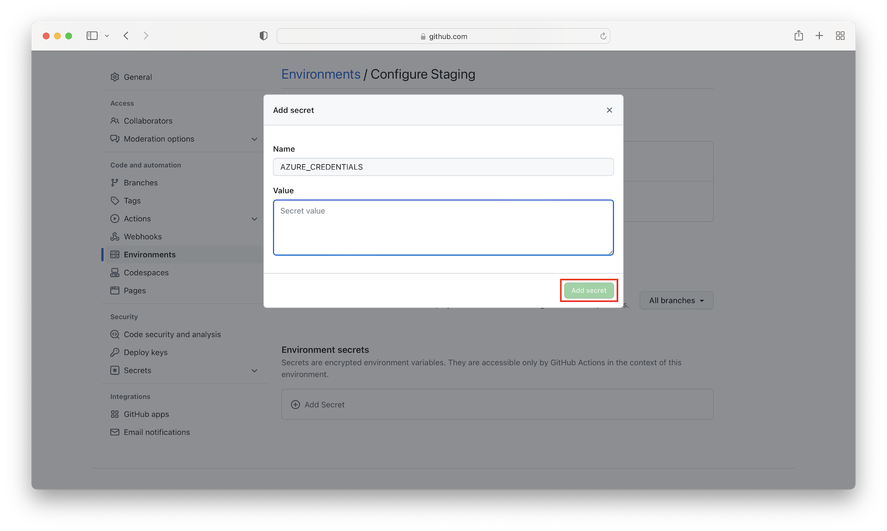

After creating the above secrets for the `Production` environment, you can enable `Required Viewers` before deploying to this environment. This will allow you to specify people or teams that may approve workflow runs when they access this environment. To enable `Required Viewers`, under the `Environment Protection Rules` section, click the checkbox next to `Required Viewers` and search for your GitHub username and select it from the dropdown and click the `Save Protection Rules` button.

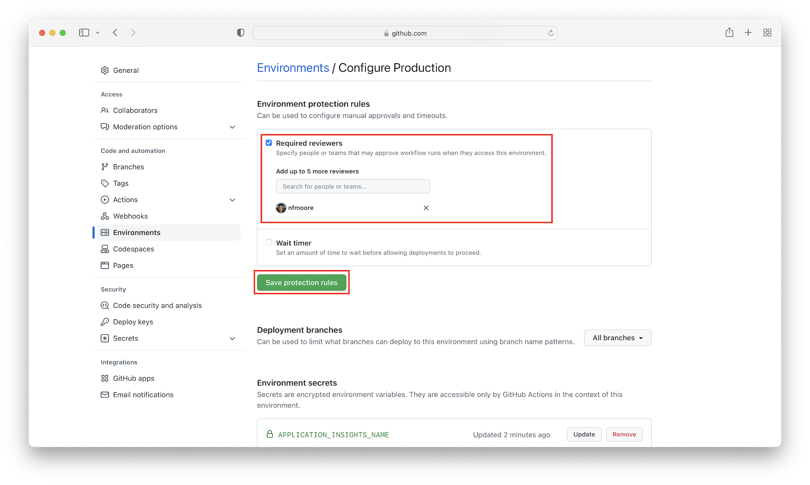

## 2. Execute Workflows

> **Note:**
> The `Deploy Model to Online Endpoint` and `Deploy Model to Batch Endpoint` workflows will enable scheduled execution of the `Data Export` and `Data Drift` pipelines periodically.

From your GitHub repository select `Actions` from the menu. From here you will be able to view the GitHub Action implementing the CI/CD pipeline for this example scenario. By default, the workflow in this example scenario is triggered manually within GitHub.

In this example scenario, four workflows have been developed in the `.github/workflows` directory. Reusable sub workflows are in the `.github/templates` directory and are used more than once across one or more workflows. The main workflows in this example scenario are:

- `Code Quality`: workflow implementing regular code scanning on select branches when code is pushed and on a schedule.
- `Build Data Assets`: workflow intended to deploy new data assets to staging and production environments as they are created. Data assets are defined in specification files that trigger the workflow as changes are committed.
- `Build Environments`: workflow intended to deploy new Azure Machine Learning environments to staging and production environments as they are created. Azure Machine Learning environments are defined in specification files that trigger the workflow as changes are committed.
- `Build Model`: workflow that trains a model in a staging environment. Triggering this workflow on a schedule can be used to implement a model retraining process.
- `Deploy Model to Online Endpoint`: create an online endpoint and deployments referencing the model, runs end-to-end tests, copy model assets to the production environment, and recreate the online endpoint and deployments in the production environment. This workflow is triggered automatically upon completion of the `Build Model` workflow.
- `Deploy Model to Batch Endpoint`: create a batch endpoint and deployments referencing the model, copy model assets to the production environment, and recreates the batch endpoint and deployments in the production environment. This workflow is triggered automatically upon completion of the `Build Model` workflow.
- `Build Azure Data Factory`: workflow that builds the data factory template.
- `Deploy to Azure Data Factory`: workflow that deploys the data factory template. This workflow is triggered automatically upon completion of the `Build Azure Data Factory` workflow.

To execute the workflow you can manually trigger the workflow in GitHub Actions `Workflows` menu. In the sidebar, you will need to trigger all four workflows. To trigger a workflow, select the workflow then click `Run workflow`. Execute the workflows in the following order:

1. `Code Quality`
2. `Build Data Assets`
3. `Build Environments`
4. `Build Model`
5. `Build Azure Data Factory`

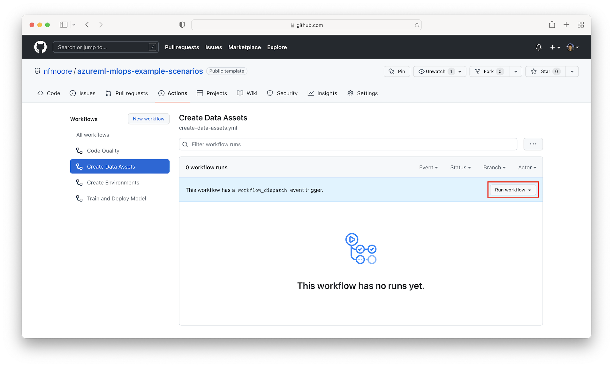

Note that the `Train Model` workflow depends on `Create Data Assets` and `Create Environments`.


Once the `Train Model` workflow completes the following workflows will be automatically executed:

1. `Deploy Model for Batch Inference`
2. `Deploy Model for Online Inference`

Once the `Build Azure Data Factory` workflow completes the `Deploy to Azure Data Factory` workflow will be automatically executed.

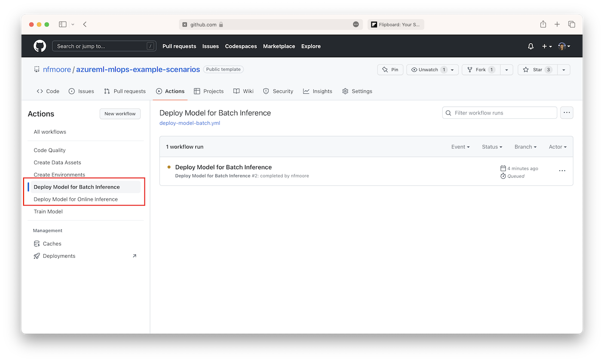

> **Note:**
>
> If you do not want to deploy a model to an online or batch managed endpoint as part of this proof-of-concept you can cancel the `Deploy Model for Online Inference` or `Deploy Model for Batch Inference` workflow respectively.
>
>If you do not want to highlight Azure Data Factory integration as part of this proof-of-concept you do not need to run the `Build Azure Data Factory` workflow

Manual approval is required to deploy artifacts to the `Production` environment. When prompted, click the `Review Deployment` button to give approval and commence the `Upload Model to Production` job. This will need to be repeated for the `Deploy to Production` job across both the `Deploy Model for Batch Inference` workflow and `Deploy Model for Online Inference` workflow. The approver(s) were specified in `1.3` above.

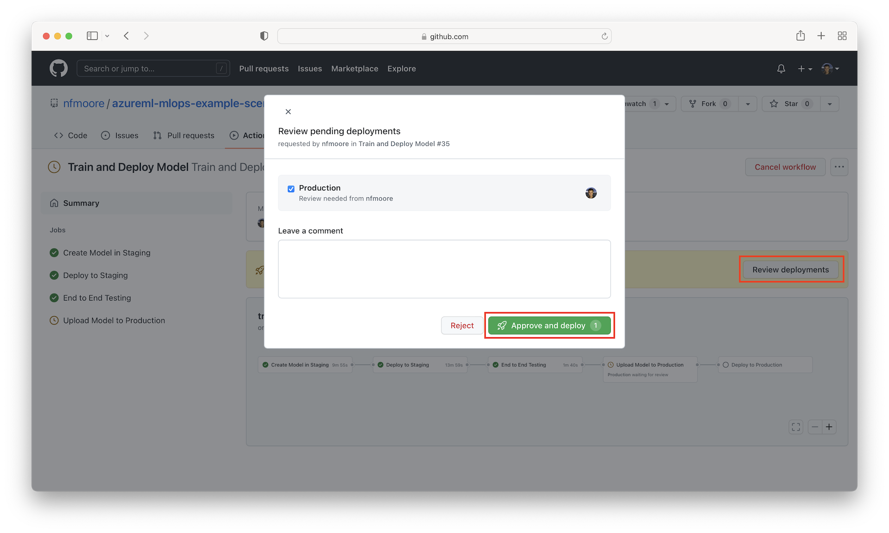

Once the workflow has finished executing all artifacts will have been deployed to both `Staging` and `Production` environments.

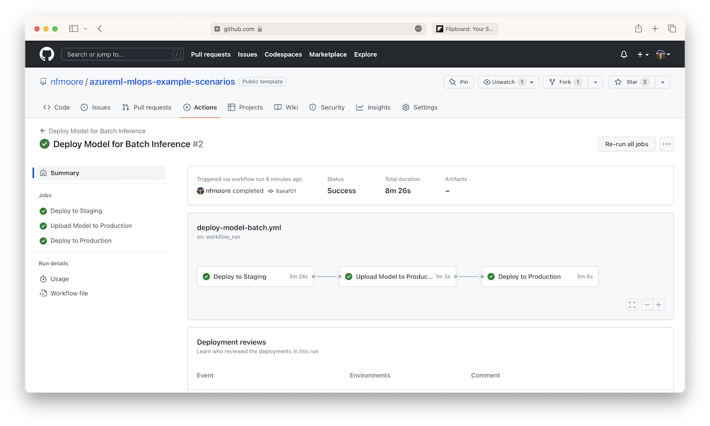

### Next Steps

From the `Endpoints` sidebar button in the Azure Machine Learning workspace, you can view the online managed endpoint and batch managed endpoint which have been deployed by the GitHub Actions workflow.

From the `Real-time endpoints` tab, online managed endpoints can be viewed. Different deployments can be tested under the `Test` tab. You can also interact with online managed endpoints using the CLI, SDK, and REST API.

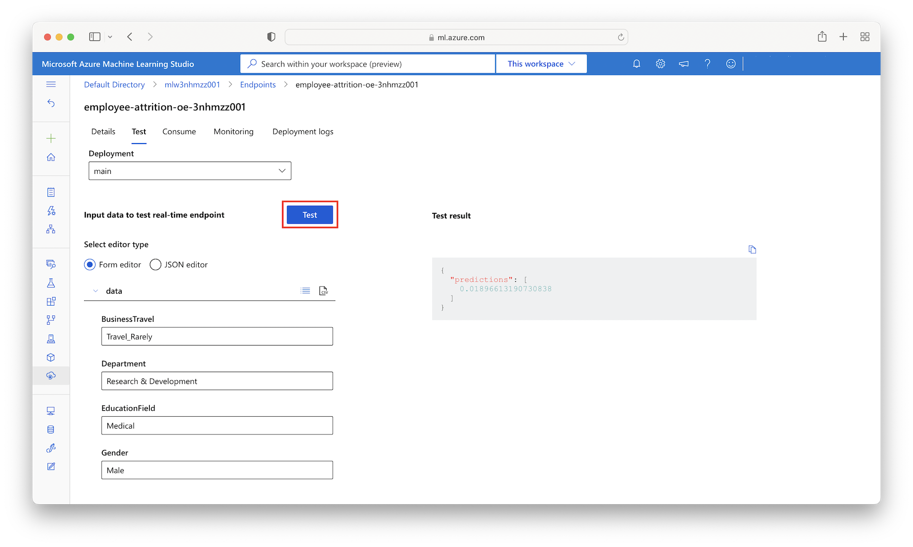

To test batch managed endpoints select the relevant endpoint under the `Batch endpoints` tab and select `Create job`. You will need to configure the job settings, data source, and output location.

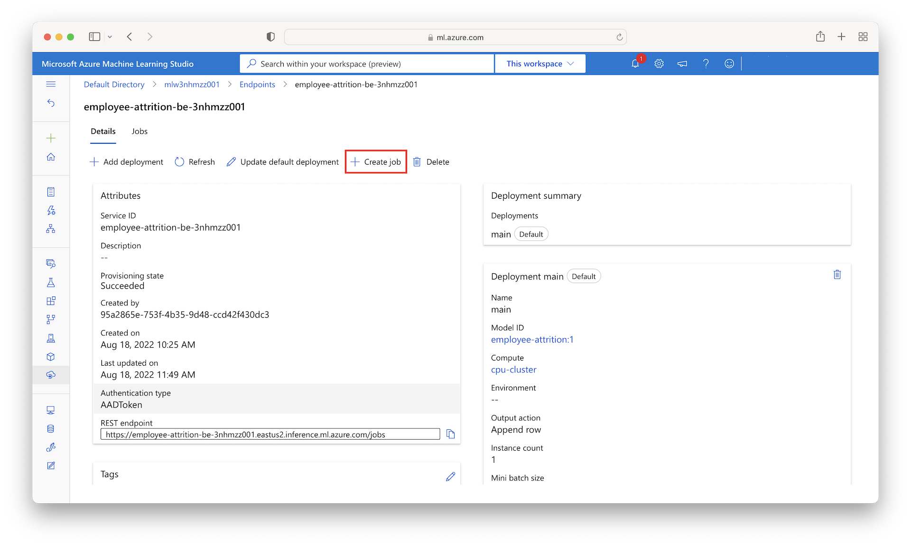

The `employee-attrition-inference-batch` data asset can be used for illustrative purposes.

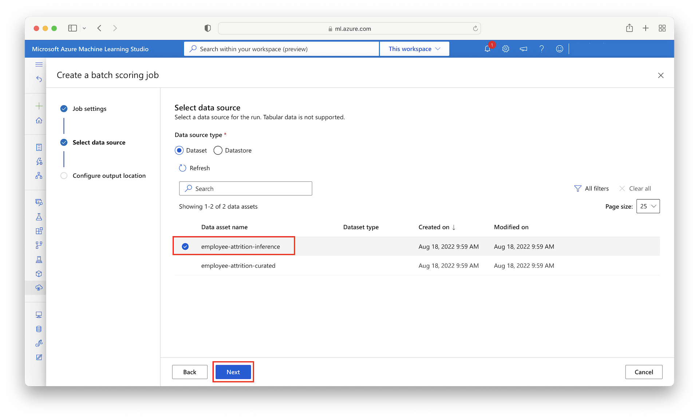

Azure Monitor can be used to monitor metrics collected from the deployments as discussed in the [Batch Managed Endpoint](./.github/docs/batch-endpoint.md) and [Online Managed Endpoint](./.github/docs/online-endpoint.md) sections of the documentation.

## Related Resources

You might also find these references useful:

- [Using environments for deployment](https://docs.github.com/en/actions/deployment/targeting-different-environments/using-environments-for-deployment)
- [Understanding GitHub Actions](https://docs.github.com/en/actions/learn-github-actions/understanding-github-actions)
