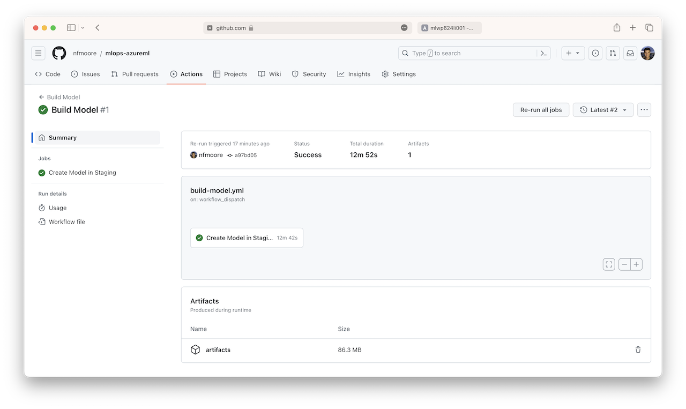

# Step-by-Step Setup

> **Note:**
> The purpose of this section is to describe the steps required to set up all parts of this example scenario.

> **Note:**
> The aim of this demo is to setup a simple proof-of-concept, therefore a single resource group is used. If separate resources groups are required, the following instructions/steps will need adjustment to reflect this.

## Prerequisites

Before implementing this example scenario the following is needed:

- Azure subscription (contributor or owner)
- GitHub account

## 1. Initial Setup

> **Note:**
> As with all Azure Deployments, this will incur associated costs. Remember to teardown all related resources after use to avoid unnecessary costs.

> **Estimated setup time:**
>
> - Azure resource deployments: 20 minutes
> - Configure GitHub environments and secrets: 5 minutes
> - Run all GitHub workflows: 90 minutes

### 1.1. Deploy Azure Resources

You will need to create a resource group for resources associated with **`Staging`** and **`Production`** environments. The same resource group will be used as part of the custom deployment.


Once these have been created a service principal must be created with a **`contributor`** role assigned to each resource group.

The following command can be used to create this service principal.

```bash

az ad sp create-for-rbac --name <service-principal-name> --role contributor --scopes /subscriptions/<subscription-id>/resourceGroups/<resource-group-name> --sdk-auth
```

The command should output a JSON object similar to this:

```bash
 {
 "clientId": "<GUID>",
 "clientSecret": "<STRING>",
 "subscriptionId": "<GUID>",
 "tenantId": "<GUID>",
 "resourceManagerEndpointUrl": "<URL>"
 (...)
 }
```

> **Tips:**
>
> - Use the [Azure Cloud Shell](https://learn.microsoft.com/azure/cloud-shell/overview).
> - Store this JSON object. The JSON object, `clientId` and `clientSecret` will be used in subsequent steps.


Next an Azure Machine Learning workspace with associated resources for **`Staging`** and **`Production`** environments will need to be created. To assist with this an ARM template has been created to automate the deployment of all necessary resources.

Use the **`Deploy to Azure`** button below to automatically deploy these resources.

[](https://portal.azure.com/#create/Microsoft.Template/uri/https%3A%2F%2Fraw.githubusercontent.com%2Fnfmoore%2Fazureml-mlops-example-scenarios%2Fmain%2Finfrastructure%2Fmain.json)

In the custom deployment you will need to add the **`clientId`** and **`clientSecret`** for the service principal created earlier. Add the **`clientId`** value in the **`Service Principal Client Id`** field and the **`clientSecret`** value in the **`Service Principal Secret`** field.


> **Note:** The above deployment will also upload the required data sets and MLTable file specifications found in the `core/data/uci-credit-card-default/curated/`, `core/data/uci-credit-card-default/inference/batch/`, and `core/data/uci-credit-card-default/inference/online/` directories to the default blob datastore `workspaceblobstore`. These will be used as part of this example scenario.

Once the deployment has been completed, you will see several Azure resources available in the resource group. Each component follows a consistent naming standard consisting of an abbreviation of the Azure resource name, followed by the **`Workload Identifier`** and then the environment reference (as shown below).

> **Tips:** The **`Staging Environment Identifier`**, **`Production Environment Identifier`**, **`Workload Identifier`** is required when configuring GitHub secrets and variables in step 1.3.


### 1.3. Configure GitHub Actions Environments

First you will configure GitHub Action secrets. These are encrypted environment variables used within GitHub Actions Workflows.

Click the **`Settings`** tab in the menu bar of your GitHub repository and on the new page then select **`Actions`** from the **`Secrets and variables`** section in the sidebar. Click the **`New repository secret`** button to create a new secret.

You need to create the following repository secrets:

| Secret name | How to find secret value | Secret type |
|:------------|:-------------------------|:------------|
| AZURE_CREDENTIALS | A JSON object with details of your Azure Service Principal. [This](https://github.com/marketplace/actions/azure-login#configure-deployment-credentials) document will help you configure a service principal with a secret. The value will look something like: `{ "clientId": "<GUID>", "clientSecret": "<GUID>", "subscriptionId": "<GUID>", "tenantId": "<GUID>", ... }`| Repository secret |


Next you will need to create GitHub Environments are used to describe the **`Staging`** and **`Production`** deployment targets and will be used to configure protection rules and secrets in this example scenario.

To set up these environments, select **`Environments`** from the sidebar. Click the **`New environment`** button and create an environment called **`Staging`**.


Next you will need to create an environment variable for each environment. Click the **`Add variable`** button to create an environment variable in the first environment called **`Staging`**. You need to create the following environment variables for each environment:

| Variable name | How to find variable value | Variable type |
|:------------|:-------------------------|:------------|
| RESOURCE_INSTANCE | The value of equal to the **`Staging Environment Identifier`** from the custom deployment (by default this is **`001`**). | Environment variable |


Repeat the above two steps to create a second environment called **`Production`**.


Next you will need to create an repository variable. On the new page then select **`Actions`** from the **`Secrets and variables`** section in the sidebar. Click the **`New repository secret`** button to create a new secret.

You need to create the following repository variables:

| Variable name | How to find variable value | Variable type |
|:------------|:-------------------------|:------------|
| RESOURCE_GROUP | The name of the resource group that resources are deployed into. | Repository variable |
| WORKLOAD_IDENTIFIER | The 6 random characters common to each resource in your resource group. This is from the custom deployment. For example, `sw9g3m`. | Repository variable |


After creating the above secrets and variables, you can enable **`Required reviewers`** before deploying to this environment. This will allow you to specify people or teams that may approve workflow runs when they access this environment.

To enable **`Required reviewers`**, select **`Environments`** from the sidebar and click the **`Production`** environment. Under the **`Deployment protection rules`** section, click the checkbox next to **`Required reviewers`** and search for your GitHub username and select it from the dropdown and click the **`Save protection rules`** button.


## 2. Execute Workflows

> **Note:** The `Deploy Model to Online Endpoint` and `Deploy Model to Batch Endpoint` workflows will enable scheduled execution of the `Data Export` and `Data Drift` pipelines periodically.

From your GitHub repository select **`Actions`** from the menu. From here you will be able to view the GitHub Action implementing the CI/CD pipeline for this example scenario. By default, the workflow in this example scenario is triggered manually within GitHub.

In this example scenario, four workflows have been developed in the `.github/workflows` directory. Reusable sub workflows are in the `.github/templates` directory and are used more than once across one or more workflows. The main workflows in this example scenario are:

- `Code Quality`: workflow implementing regular code scanning on select branches when code is pushed and on a schedule.
- `Build Data Assets`: workflow intended to deploy new data assets to staging and production environments. Data assets are defined in specification files that trigger the workflow as changes are committed.
- `Build Environments`: workflow intended to deploy new Azure Machine Learning environments to the centralised Machine Learning Registry for use in the staging and production environments. Azure Machine Learning environments are defined in specification files that trigger the workflow as changes are committed.
- `Build Model`: workflow that trains a model in a staging environment and registers the model to the centralised Machine Learning Registry for use in the staging and production environments. Triggering this workflow on a schedule can be used to implement a model retraining process.
- `Deploy Model to Online Endpoint`: create an online endpoint and deployments referencing the model, runs end-to-end tests, copy model assets to the production environment, and recreate the online endpoint and deployments in the production environment. This workflow is triggered automatically upon completion of the `Build Model` workflow.
- `Deploy Model to Batch Endpoint`: create a batch endpoint and deployments referencing the model, copy model assets to the production environment, and recreates the batch endpoint and deployments in the production environment. This workflow is triggered automatically upon completion of the `Build Model` workflow.
- `Build Azure Data Factory`: workflow that builds the data factory template.
- `Deploy to Azure Data Factory`: workflow that deploys the data factory template. This workflow is triggered automatically upon completion of the `Build Azure Data Factory` workflow.

To execute the workflow you can manually trigger the workflow in GitHub Actions **`Workflows`** menu. In the sidebar, you will need to trigger all four workflows. To trigger a workflow, select the workflow then click **`Run workflow`**. Execute the workflows in the following order:

1. `Build Data Assets`
2. `Build Environments`
3. `Build Model`
4. `Build Azure Data Factory`

The image below illistrates executing the `Build Data Assets` workflow.


Before deploying artifacts to the **`Production`** environment manual approval is required. When prompted, click the **`deview Deployment`** button to give approval, adding notes as required.


After executing the `Build Environment` workflow you will be able to view the curated environments in the Machine Learning Registry. To view the environments, navigate to the Machine Learning Registry and select the **`Environments`** tab.


After executring both the `Deploy Data Assets` and `Deploy Environments` workflows the `Build Model` workflow can be triggered.


After executing the `Build Model` workflow you will be able to review the model job pipeline in the Azure Machine Learning workspace. To view the model training process, navigate to the Azure Machine Learning workspace and select the **`Jobs`** tab.




You will also be able to view the model in the Machine Learning Registry by selecting the **`Models`** tab.


Once the `Build Model` workflow completes the following workflows will be automatically executed:

1. `Deploy Model for Batch Inference`
2. `Deploy Model for Online Inference`

Once the `Build Azure Data Factory` workflow completes the `Deploy to Azure Data Factory` workflow will be automatically executed.

> **Note:**
>
> - If you do not want to deploy a model to an online or batch managed endpoint as part of this proof-of-concept you can cancel the `Deploy Model for Online Inference` or `Deploy Model for Batch Inference` workflow respectively.
> - If you do not want to highlight Azure Data Factory integration as part of this proof-of-concept you do not need to run the `Build Azure Data Factory` workflow


Manual approval is required to deploy artifacts to the **`Production`** environment. When prompted, click the `Review deployments` button to deploy the model in the production environment.

This will need to be repeated for the `Deploy Model for Batch Inference` workflow and `Deploy Model for Online Inference` workflow. The approver(s) were specified in `1.3` above.


Once the workflow has finished executing all artifacts will have been deployed to both **`Staging`** and **`Production`** environments.


## 3. Next Steps

### 3.1. Batch and Real-time Endpoints

From the **`Endpoints`** sidebar button in the Azure Machine Learning workspace, you can view the online managed endpoint and batch managed endpoint which have been deployed by the GitHub Actions workflow.

From the **`Batch endpoints`** tab, batch managed endpoints can be viewed. To test batch managed endpoints select the relevant endpoint under the **`Batch endpoints`** tab and select **`Create job`**. You will need to configure the job settings, data source, and output location.


The `credit-card-default-inference-batch-ds` data asset can be used for illustrative purposes.


This will trigger an Azure Machine Learning job which can be viewed from the **`Jobs`** tab.


From the **`Real-time endpoints`** tab, online managed endpoints can be viewed. Different deployments can be tested under the **`Test`** tab. You can also interact with online managed endpoints using the CLI, SDK, and REST API.


Monitoring can be performend from the managed online endpoint or Azure Monitor can be used to monitor metrics collected from the deployments as discussed in the [Batch Managed Endpoint](./.github/docs/batch-endpoint.md) and [Online Managed Endpoint](./.github/docs/online-endpoint.md) sections of the documentation.


#### 3.2. Azure Data Factory

To test calling a batch managed endpoint from Azure Data Factory you can trigger the pipeline from the Azure Data Factory workspace by slecting the **`Debug`** button.


## Resource Clean-Up

There are two main tasks required to clean-up this deemo:

1. Delete the Azure Resoure Group
2. Delete the Service Principal

### Delete the Resource Group

From the Azure portal, navigate to the demo resource group and select **`Delete resource group`** toolbar button. This will then prompt a confirmation screen, requiring the resource group name to be entered and the **`Delete`** button to be selected.

### Delete the Service Principal

From the [Azure Cloud Shell](https://learn.microsoft.com/azure/cloud-shell/overview) run the following command with your service principal ID in bash.

```bash

az ad sp delete --id <service-principal-name>
```

## Related Resources

You might also find these references useful:

- [Using environments for deployment](https://docs.github.com/en/actions/deployment/targeting-different-environments/using-environments-for-deployment)
- [Understanding GitHub Actions](https://docs.github.com/en/actions/learn-github-actions/understanding-github-actions)
